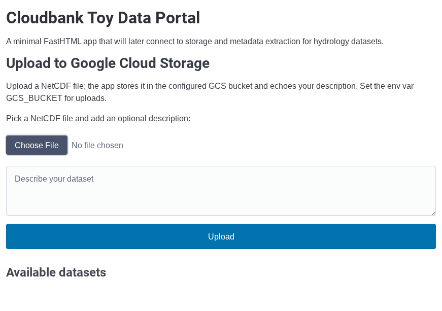
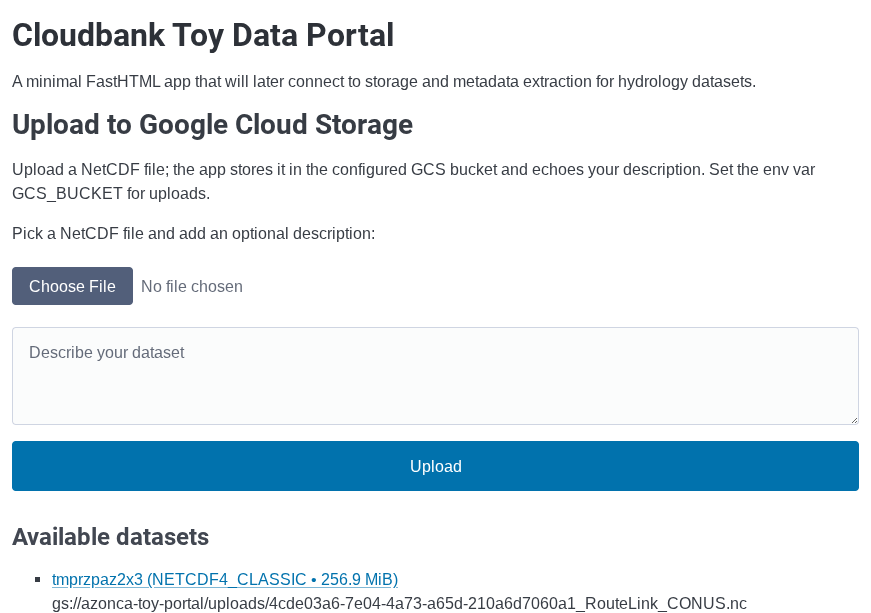
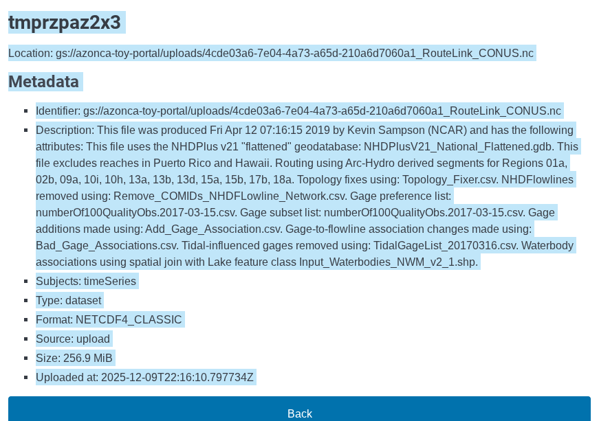

# 2 - Build and deploy the toy data portal container

Goal: deploy the Python-based toy data portal web app container to the Google Kubernetes Engine (GKE) Autopilot cluster from step 0. The image is published to the GitHub Container Registry (GHCR) and the repository is public, so no pull secret is needed.

For app details (upload flow to Google Cloud Storage, required environment variables, local development, tests, and the continuous integration workflow), see the repository README: https://github.com/zonca/cloudbank_toy_data_portal.

## Deploy to the Autopilot cluster
Run these from Cloud Shell while connected to the `toy-hydro-cluster` context:

## Create and permit the storage bucket
1) Pick a Google Cloud Storage bucket name and create it in the same region as the cluster (example: `us-west1`):
```bash
export PORTAL_BUCKET="${USER}-toy-portal"
gcloud storage buckets create "gs://${PORTAL_BUCKET}" --location=us-west1
```
Create a Google service account for the portal, and allow the matching Kubernetes service account to impersonate it (Workload Identity):
```bash
PROJECT_ID="$(gcloud config get-value project)"
PROJECT_NUMBER="$(gcloud projects describe "${PROJECT_ID}" --format='value(projectNumber)')"
gcloud iam service-accounts create portal-gsa --display-name="Portal GSA"
kubectl create namespace portal || true
kubectl create serviceaccount portal-sa -n portal || true
kubectl annotate serviceaccount portal-sa -n portal \
  "iam.gke.io/gcp-service-account=portal-gsa@${PROJECT_ID}.iam.gserviceaccount.com" --overwrite
gcloud iam service-accounts add-iam-policy-binding "portal-gsa@${PROJECT_ID}.iam.gserviceaccount.com" \
  --member="serviceAccount:${PROJECT_ID}.svc.id.goog[portal/portal-sa]" \
  --role="roles/iam.workloadIdentityUser"
```
Grant the portal Google service account read and write access to the bucket:
```basgcloud storage buckets add-iam-policy-binding "gs://${PORTAL_BUCKET}" \
  --member="allUsers" \
  --role="roles/storage.objectViewer"h
gcloud storage buckets add-iam-policy-binding "gs://${PORTAL_BUCKET}" \
  --member="serviceAccount:portal-gsa@${PROJECT_ID}.iam.gserviceaccount.com" \
  --role="roles/storage.objectCreator"
gcloud storage buckets add-iam-policy-binding "gs://${PORTAL_BUCKET}" \
  --member="serviceAccount:portal-gsa@${PROJECT_ID}.iam.gserviceaccount.com" \
  --role="roles/storage.objectViewer"
gcloud storage buckets add-iam-policy-binding "gs://${PORTAL_BUCKET}" \
  --member="allUsers" \
  --role="roles/storage.objectViewer"
```
The public read grant above lets notebooks download objects without extra credentials. If you prefer to keep the bucket private, skip the `allUsers` binding and download with authenticated tools instead.

## Deploy
2) Save the manifest using that bucket name. Important: the final `EOF` line must start at column 1 (no spaces) or the shell will keep showing `>` waiting for input.
```bash
cat > portal.yaml <<EOF
apiVersion: apps/v1
kind: Deployment
metadata:
  name: toy-portal
  namespace: portal
spec:
  replicas: 1
  selector:
    matchLabels:
      app: toy-portal
  template:
    metadata:
      labels:
        app: toy-portal
    spec:
      serviceAccountName: portal-sa
      containers:
        - name: portal
          image: ghcr.io/zonca/cloudbank_toy_data_portal:latest
          command: ["python", "-m", "cloudbank_portal"]
          workingDir: /app/src
          imagePullPolicy: Always
          ports:
            - containerPort: 8000
          resources:
            requests:
              memory: "256Mi"
              cpu: "100m"
            limits:
              memory: "512Mi"
              cpu: "200m"
          env:
            - name: GCS_BUCKET
              value: "${PORTAL_BUCKET}"
---
apiVersion: v1
kind: Service
metadata:
  name: toy-portal
  namespace: portal
spec:
  type: LoadBalancer
  selector:
    app: toy-portal
  ports:
    - port: 80
      targetPort: 8000
      protocol: TCP
EOF
```
3) Apply and watch:
```bash
kubectl apply -f portal.yaml
kubectl -n portal get pods -w
```
Autopilot will create nodes on demand if none are running yet.

4) Grab the external IP and test:
```bash
PORTAL_IP=$(kubectl -n portal get svc toy-portal -o jsonpath='{.status.loadBalancer.ingress[0].ip}')
echo "External IP: ${PORTAL_IP}"
curl "http://${PORTAL_IP}/healthz"
```
Expected `healthz` output: `{"status":"ok"}`. Opening `http://<EXTERNAL-IP>/` in a browser shows the portal landing page and upload form:


Download one of the sample NetCDF files listed in `README.md` (for example the RouteLink NetCDF at https://www.hydroshare.org/resource/0a596929a3e5411bb0032a8de35e5089/), upload it through the form, and compare what you see with the screenshots to confirm the file is present:


Clicking a dataset shows extracted metadata:

